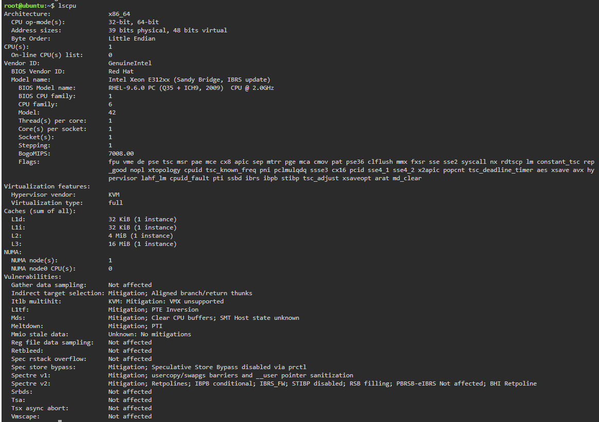
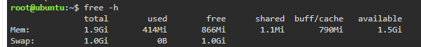

## Linux System Details

I used the KillerCoda Playground to check the basic information of the Linux server. Different Linux commands were used to view the operating system, processor, memory, and available storage.

### Operating System

I used the following command:

```bash
cat /etc/os-release
```

The result shows that the server uses **Ubuntu 24.04.4 LTS**.


### CPU Information

To check the processor details, I used:

```bash
lscpu
```

The server has an **Intel Xeon E312xx processor** and **1 CPU core**.



### Memory

I checked the available memory with:

```bash
free -h
```

The server has about **1.9 GiB of RAM**.



### Disk Space

For the storage information, I ran:

```bash
df -h
```

The available disk capacity shown is approximately **19G**.


## Possible Cloud Services

If this Linux server needs to be moved to a cloud environment, each major cloud provider has a virtual machine service that can be used.

| Provider              | Service That Can Host the Server |
| --------------------- | -------------------------------- |
| AWS                   | Amazon EC2                       |
| Microsoft Azure       | Azure Virtual Machines           |
| Google Cloud Platform | Google Compute Engine            |

Amazon EC2 can be used to run the Ubuntu server on AWS. Azure Virtual Machines provides a similar option for Microsoft Azure, while Google Compute Engine can run the same type of Linux workload on GCP.

These services allow the server to operate as a cloud-based virtual machine instead of remaining on the original environment.
