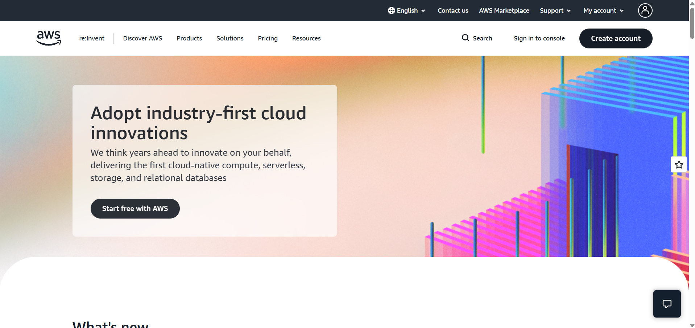

# AWS Research

## Brief Overview

Amazon Web Services (AWS) is a cloud computing platform provided by Amazon. It offers many services that allow individuals and organizations to run applications, store information, manage databases, and build cloud-based systems without owning all the physical infrastructure.

## Global Infrastructure

AWS has a global infrastructure consisting of Regions and Availability Zones. Regions are geographic areas where AWS operates its services, while Availability Zones are separate locations within a Region. This design helps organizations build applications that are reliable and available.

## Cloud Management Console

The AWS Management Console is a web-based interface for accessing and managing AWS services. Users can create resources, configure services, monitor workloads, and manage their cloud accounts through the console.

## Four Core Services

1. *Amazon EC2* – Provides virtual servers for running applications.
2. *Amazon S3* – Provides scalable object storage for files and data.
3. *Amazon RDS* – Provides managed relational database services.
4. *Amazon VPC* – Provides networking capabilities for AWS resources.

## Three Advantages

1. AWS provides a wide range of cloud services.
2. AWS allows resources to scale according to workload requirements.
3. AWS has a large global infrastructure for deploying applications.

## Typical Enterprise Use Cases
Enterprises use AWS for hosting websites and applications, storing business data, running databases, backup and disaster recovery, data analytics, and scalable enterprise workloads.

Enterprises use AWS for hosting websites and applications, storing business data, running databases, backup and disaster recovery, data analytics, and scalable enterprise workloads.

## screenshot

