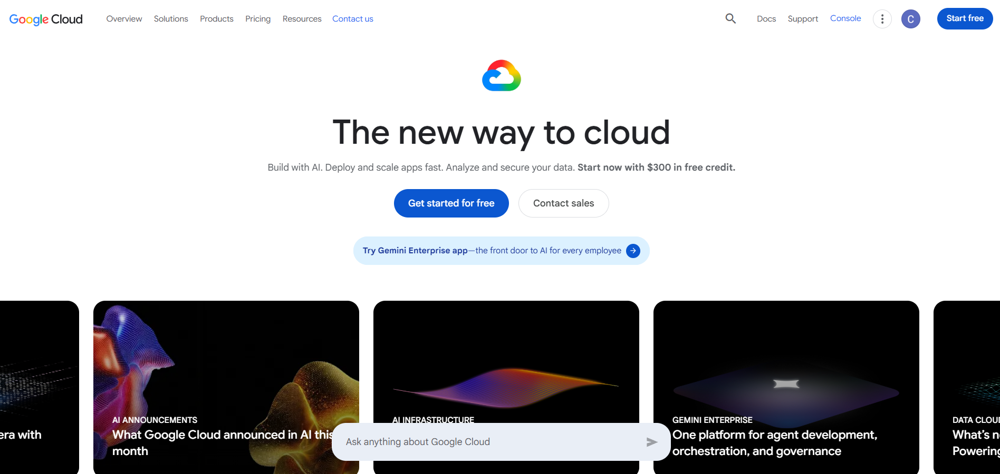

# Google Cloud Platform Research

## Brief Overview

Google Cloud Platform (GCP) is Google's cloud computing platform. It provides services for computing, storage, databases, networking, artificial intelligence, machine learning, and application development.

## Global Infrastructure

Google Cloud has a worldwide infrastructure organized into Regions and Zones. These locations allow organizations to deploy resources closer to their users and improve application availability and performance.

## Cloud Management Console

Google Cloud Console is a web-based interface used to manage GCP resources. It allows users to create virtual machines, manage storage, configure services, monitor resources, and control access.

## Four Core Services

1. *Google Compute Engine* – Provides virtual machines for running workloads.
2. *Google Cloud Storage* – Provides object storage for files and data.
3. *Cloud SQL* – Provides managed relational database services.
4. *Google Kubernetes Engine (GKE)* – Provides managed Kubernetes for containerized applications.

## Three Advantages

1. GCP provides strong Artificial Intelligence and Machine Learning capabilities.
2. GCP has strong support for Kubernetes and containers.
3. Google Cloud provides a global infrastructure for applications and services.

## Typical Enterprise Use Cases
Enterprises use GCP for AI and machine learning workloads, data analytics, application hosting, containerized applications, large-scale data storage, and Kubernetes deployments.

## screenshot

Enterprises use GCP for AI and machine learning workloads, data analytics, application hosting, containerized applications, large-scale data storage, and Kubernetes deployments.
